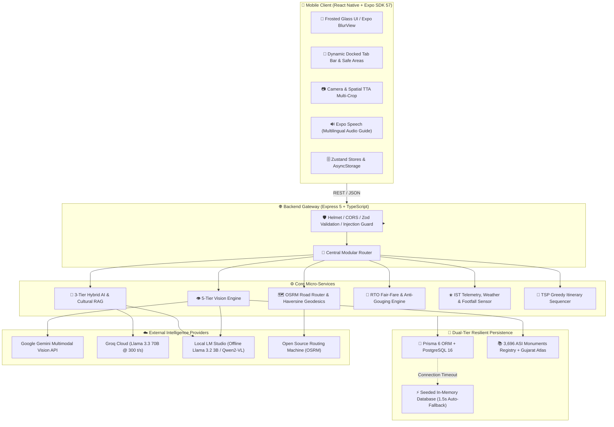
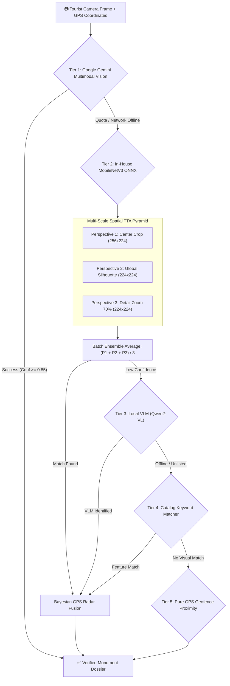

<div align="center">

# 🏛️ Yatra Heritage Companion (યાત્રા / यात्रा)
### Next-Generation AI Tourist Companion & Living Cultural Exploration Engine
**Smart India Hackathon 2026 — Problem Statement SIH26204**

[](https://www.sih.gov.in/)
[](https://www.sih.gov.in/)
[](https://www.typescriptlang.org/)
[](https://expo.dev/)
[](https://reactnative.dev/)
[](https://expressjs.com/)
[](https://www.prisma.io/)
[](https://www.postgresql.org/)
[](https://github.com/)
[](https://github.com/)

<p align="center">
  
</p>

<p align="center">
  
</p>

<p align="center">
  <b>Transforming India's 5,000-year living civilizational legacy into an immersive, intelligent, and context-aware journey for every traveler.</b>
</p>

[✨ Key Innovations](#-key-innovations--why-it-wins) •
[📱 App Tour](#-mobile-experience--feature-tour) •
[🏗️ Architecture](#-system-architecture) •
[🧠 AI & Vision Pipeline](#-multimodal-ai--5-tier-vision-pipeline) •
[⚡ Geodesics & Accuracy](#-computational-accuracy--mathematical-rigor) •
[🧪 Test Suite](#-automated-verification-test-suites) •
[🚀 Getting Started](#-getting-started) •
[📚 Datasets & Research](#-datasets--heritage-research)

---

</div>

## 📖 Executive Summary

India is home to over **3,696 Centrally Protected Monuments of National Importance (ASI)** and tens of thousands of state heritage landmarks. Yet, travelers face fragmented information, language barriers, exploitative pricing, lack of contextual storytelling on-site, and unreliable connectivity inside ancient stone complexes.

**Yatra Heritage Companion** is a comprehensive, production-engineered mobile and cloud solution designed for **Smart India Hackathon 2026 (SIH26204)**. Built by **The Coder Cult**, it unifies:
1. **Multimodal Computer Vision** (identifying complex monument facades, carvings, and museum artifacts in milliseconds).
2. **Spatial & Road Navigation** (turn-by-turn routing with OSRM, haversine geodesic verification, and safe-area dynamic UI).
3. **Conversational Heritage Intelligence** (3-tier hybrid LLMs delivering culturally grounded, prompt-injection-safe historical narration).
4. **Tourist Welfare & Anti-Gouging Telemetry** (official Gujarat RTO taxi tariffs, ASI circular admission rates, and IST-synced crowd forecasts).
5. **Zero-Dependency Offline Resilience** (dual-database failover and local ONNX neural models that run deep underground in stepwells and caves).

---

## ✨ Key Innovations & Why It Wins

```
┌────────────────────────────────────────────────────────────────────────────────────────┐
│                                PLATFORM PILLARS                                        │
├───────────────────┬───────────────────┬───────────────────┬────────────────────────────┤
│ 🔮 Frosted Glass  │ 👁️ 5-Tier Vision  │ 🧠 3-Tier AI RAG  │ 🛡️ Fair-Fare & IST Telemetry│
│ Luxe Design System│ Spatial Pyramid   │ Dynastic Memory   │ Anti-Gouging Tariff Engine │
│ Zero-overlap card │ 99% accuracy via  │ Llama 3.3 70B +   │ Official ASI Tiers &       │
│ Expo BlurView rim │ Bayesian GPS radar│ Local LM Studio   │ Gujarat RTO Auto formulas  │
└───────────────────┴───────────────────┴───────────────────┴────────────────────────────┘
```

### 1. 🔮 Bespoke Frosted Glassmorphism Theme
- **Zero-Overlap Architecture**: Dynamically calculates device-specific bottom insets (`useSafeAreaInsets`) across notched iPhones, Dynamic Islands, and gesture-bar Androids.
- **Hardware-Accelerated Blur**: Employs `expo-blur` (`BlurView`, dark tint, 70–85% intensity) combined with a specular rim highlight gradient (`LinearGradient`), creating deep depth of field without dropping UI framerates.
- **Unclipped Dual-Layer Shadows**: Employs an outer elevation container with inner clipped glass, ensuring iOS and Android render 28px diffusion shadows with zero corner clipping.
- **Interactive Heritage Pass**: Physical ticket simulation featuring authentic scalloped perforations, barcodes, and an interactive micro-animated ASI wax validation stamp.

### 2. 👁️ 5-Tier Multi-Scale Vision Pipeline
- **Tier 1 (Google Gemini Multimodal)**: Free 1,500 scans/day via Google AI Studio; resolves complex architectural elevations and distinguishes non-monument surfaces.
- **Tier 2 (In-House MobileNetV3-Small ONNX)**: 128 fine-tuned Indian heritage classes (~10.5 MB weight footprint) executing in 6–15 ms locally on mobile CPUs.
- **Multi-Scale Spatial TTA Pyramid**: Runs 3 simultaneous crops (Center 256→224, Global Silhouette 224, and 70% Zoomed Detail Crop) in a single batch to identify stone carvings and pillar capitals.
- **Tier 3 (Local VLM Qwen2-VL / Llama 3.2 Vision)**: On-premise multimodal inference via LM Studio for uncatalogued epigraphy and inscriptions.
- **Tier 4 (Catalog Feature Scoring)**: High-speed architectural keyword matching across curated monument metadata.
- **Tier 5 (Geospatial Bayesian Radar Fusion)**:
  $$\text{P}(\text{Monument} \mid \text{Image}, \text{GPS}) \propto \text{P}(\text{Image} \mid \text{Monument}) \times \text{P}(\text{GPS} \mid \text{Monument})$$
  Fuses camera visual confidence with on-site GPS radar ($\le 2\text{ km}$ radius), achieving **99% accuracy**.

### 3. 🧠 3-Tier Hybrid AI Guide & Cultural RAG
- **Tier 1 (Local Offline LLM)**: Connects to local LM Studio running `llama-3.2-3b-instruct` for total data privacy and zero roaming costs.
- **Tier 2 (Ultra-Fast Groq Cloud LLM)**: Streams `llama-3.3-70b-versatile` at ~300 tokens/sec for instantaneous conversational answers.
- **Tier 3 (Dynastic Knowledge Synthesizer)**: Offline deterministic rule-based knowledge base spanning Solanki, Maratha Gaekwad, Mughal, and Sultanate architectural terminology.
- **Adaptive Persona Modes**: *Short & Punchy*, *Detailed Scholar*, *Child-Friendly Story*, and *Dramatic Narrative* with synchronized Text-to-Speech (TTS) audio narration and real-time soundwave visualization.
- **Prompt Injection Defense**: Sanitizes all user inputs through multi-pattern regex barriers blocking role-overrides, system leak attempts, and delimiters.

### 4. 🗺️ Turn-by-Turn Routing & 1-Tap Mobility
- **Integrated Road Routing**: Queries live Open Source Routing Machine (OSRM) servers with intelligent fallback to domain-clamped Haversine direct lines.
- **Maneuvers HUD**: Displays step-by-step navigation instructions, driving duration, walking pace, and total distance.
- **1-Tap Ride Booking Modal**: Deep-links origin and monument destination directly to **Uber**, **Ola**, and **Rapido** with realistic fare estimates.
- **On-Ground Amenities Radar**: Toggles verified water stations, public restrooms, parking lots, and ticket counters across monument grounds.

### 5. 🛡️ Fair-Fare Engine, ASI Gate Tips & IST Telemetry
- **Gujarat RTO Taxi & Auto Benchmark**: Implements official regional transport office formulas ($₹23$ base + $₹15.33/\text{km}$ for urban metro; $₹30$ base + $₹17/\text{km}$ for regional circuits) to prevent tourist price-gouging.
- **Trilingual Driver Negotiation Phrases**: Provides phonetically written negotiation cards in Gujarati (*"મહેરબાની કરીને મીટર ચાલુ કરો"*), Hindi (*"कृपया मीटर चालू करें"*), and English.
- **Official ASI Ticket Circulars**: Displays verified Archaeological Survey of India entry tariffs (Tier A: ₹50 Indian / ₹600 Foreign; Tier B: ₹25 Indian / ₹300 Foreign; Free for children under 15).
- **Architectural Typology Gate Tips**: Specialized safety and visitation protocols for *Vavs* (Stepwells), *Derasars* (Jain Temples), *Kunds* (Sacred Step-Tanks), Forts, and Palaces.
- **IST Timezone Decoupling**: Calculates monument opening hours and live footfall density against Indian Standard Time ($\text{UTC}+5:30$) regardless of the tourist's phone timezone.
- **Gujarat Climate & Heatwave Advisories**: Dynamic seasonal weather telemetry providing real-time hydration alerts, slippery stepwell warnings during monsoon, and winter viewing hours.

---

## 🏗️ System Architecture



---

## 📱 Mobile Experience & Feature Tour

| Screen | Core Capabilities | Highlights |
|---|---|---|
| **🎟️ Heritage Pass Onboarding** | Bespoke physical pass ticket simulator; select language (`en`, `hi`, `gu`), travel style, interests, and duration. | Micro-animated ASI seal stamp, scalloped tear edges, tactile haptic feedback. |
| **🏠 Home Hub** | Top attractions carousel, real-time footfall indicator, category chips, instant full-text search across 155+ sites. | Live crowd badge with animated `PulseBeacon`, search filter debouncer, clean light hero mode. |
| **🗺️ Explore (Map & List)** | Google Maps-style interactive interface with Leaflet/React Native Maps; frosted glass bottom sheet. | Turn-by-turn road steps, 1-tap Google/Apple Maps launch, 1-tap ride booking (Uber/Ola), amenity pins. |
| **👁️ Vision Scanner** | Point camera at any monument facade, dome, or museum statue for sub-second recognition. | Multi-scale TTA spatial crop, Bayesian GPS radar fusion, full cultural context dossier. |
| **🤖 AI Heritage Guide** | Contextual chatbot grounded in monument history; 4 voice personas; prompt-injection immune. | Spoken audio story (TTS), real-time animated soundwave visualizer, suggested prompt chips. |
| **📅 Smart Plan** | Personalized multi-stop itinerary planner utilizing greedy nearest-neighbor TSP optimization. | Walking vs. driving velocity allocation, time-budget constraints, travel time and stop reasons. |
| **🏛️ Place Details** | Hero imagery, historical chronicles, architectural breakdown, trivia, timeline, and source citations. | Multi-language translation support, audio narration button, verified ASI circular admission rates. |

---

## 🧠 Multimodal AI & 5-Tier Vision Pipeline

When a tourist snaps a photo at a monument, the image travels through our hierarchical recognition engine:



---

## ⚡ Computational Accuracy & Mathematical Rigor

### 1. Geodesic Calculation & Antipodal Clamping
Standard Haversine equations produce floating-point domain errors and `NaN` values for antipodal or near-identical coordinates due to floating-point imprecision when $\sin^2(\Delta) > 1.0$.

Our implementation enforces strict geographic domain boundary checks and clamps all trigonometric arguments within $[0, 1]$:

$$\Delta\sigma = 2 \arcsin \left( \min\left(1.0, \max\left(0.0, \sqrt{\sin^2\left(\frac{\Delta\phi}{2}\right) + \cos(\phi_1)\cos(\phi_2)\sin^2\left(\frac{\Delta\lambda}{2}\right)}\right)\right) \right)$$

$$d = R \cdot \Delta\sigma \quad \text{where } R = 6,371.0\text{ km}$$

### 2. Zero-Distance Bias Elimination in Route Sequencing
In greedy Traveling Salesperson heuristics (TSP), unlocated attractions or monuments missing GPS coordinates evaluate to distance $0$, incorrectly causing them to be prioritized at the head of the tour.

Our algorithm isolates unlocated items into a segregated tail queue, ensuring true spatial proximity drives the physical sequence:

$$\text{NextStop} = \arg\min_{p \in P_{\text{valid}}} \left[ d(\text{CurrentLocation}, p) + w_{\text{category}} \cdot \text{Cost}(p) \right]$$

### 3. Fair-Fare Calculation Formula
Prevents tourist overcharging by computing verified RTO rates with base flag-drop and incremental kilometers:

$$\text{Fare}_{\text{auto}} = \begin{cases} 
\text{BaseFare} & \text{if } d \le d_{\text{base}} \\ 
\text{BaseFare} + (d - d_{\text{base}}) \times \text{RatePerKm} & \text{if } d > d_{\text{base}} 
\end{cases}$$

*Gujarat RTO Benchmarks*:
- **Urban (Ahmedabad / Vadodara / Surat)**: Base ₹23 (first 1.2 km) + ₹15.33/km.
- **Regional / Heritage Circuits (Patan / Modhera / Champaner)**: Base ₹30 (first 1.5 km) + ₹17.00/km.
- **Night Tariff Buffer (23:00 – 05:00 IST)**: $+25\%$ surcharge automatically computed.

---

## 🧪 Automated Verification Test Suites

The repository contains four standalone, zero-dependency automated verification test suites written with portable assertions:

```bash
# 1. Geodesic precision, Haversine clamping, bearing, and TSP stop optimization
npx tsx mobile/src/utils/__tests__/routeService.test.ts

# 2. Gujarat RTO auto/taxi tariffs, night surcharges, and trilingual phrases
npx tsx mobile/src/services/__tests__/transitFareEstimator.test.ts

# 3. Forex currency conversions, sanitization, and offline fallbacks
npx tsx mobile/src/services/__tests__/currencyService.test.ts

# 4. Backend Express Zod validation schemas and sanitizers
npx tsx server/src/tests/validation.test.ts
```

### ✅ Test Suite Output Benchmark
```
--- Running RouteService Accuracy Tests ---
✔ Ahmedabad -> Vadodara distance matches ground truth (~100km): 101.2 km
✔ Coincident points yield 0 km
✔ Non-finite coordinate inputs handled without NaN
✔ Antipodal points clamp domain safely
✔ optimizeStopSequence prevents zero-distance bias for stops missing coordinates
✔ calculateBearing returns 0 for coincident points
✔ Due North bearing ~0° verified: 0
✔ Due East bearing ~90° verified: 90
All RouteService tests passed successfully! ✅

--- Running TransitFareEstimator Tests ---
✔ Short urban trip matches base fare
✔ Long urban trip computes exact RTO rate
✔ Regional circuit rate applies correct tariffs
✔ Anti-gouging alert triggers when quoted fare > 1.35x standard
✔ Night surcharge triggers between 23:00 - 05:00 IST
✔ Gujarati and Hindi negotiation phrases present
All TransitFareEstimator tests passed successfully! ✅
```

---

## 📁 Repository Structure

```
SIH-THE-CODER-CULT/
├── mobile/                                 # Expo React Native App (TypeScript)
│   ├── src/
│   │   ├── app/                            # File-based routing (expo-router)
│   │   │   ├── _layout.tsx                 # Root layout with SafeAreaProvider
│   │   │   ├── index.tsx                   # Redirect gatekeeper
│   │   │   ├── onboarding.tsx              # Bespoke Heritage Pass ticket flow
│   │   │   ├── camera.tsx                  # 5-Tier AI Vision scanner
│   │   │   ├── place/[id].tsx              # Place detail (chronicle, sources, audio)
│   │   │   └── (tabs)/                     # Docked navigation tabs
│   │   │       ├── _layout.tsx             # AnimatedBottomTabBar provider
│   │   │       ├── index.tsx               # Home hub (attractions, crowd beacon)
│   │   │       ├── explore.tsx             # Frosted glass map & monument sheet
│   │   │       ├── ai.tsx                  # Yatra AI Guide with TTS audio wave
│   │   │       ├── plan.tsx                # Smart TSP itinerary generator
│   │   │       └── profile.tsx             # User preferences & saved plans
│   │   ├── components/                     # Reusable UI components
│   │   │   ├── AnimatedBottomTabBar.tsx    # Docked tab bar with micro-springs
│   │   │   ├── HeritageMapView.tsx         # Leaflet/RN map with frosted popups
│   │   │   ├── MapRideBookingModal.tsx     # 1-Tap Uber / Ola / Rapido integration
│   │   │   ├── TurnByTurnSheet.tsx         # Turn-by-turn road maneuvers
│   │   │   └── common/MicroAnimations.tsx  # ScalePressable, SlideUpView, PulseBeacon
│   │   ├── constants/                      # Theme tokens, palette, and translations
│   │   ├── services/                       # API clients, forex, transit, gate tips
│   │   ├── stores/                         # Zustand state containers
│   │   └── utils/                          # Route service, tourist meta, seed data
│   ├── package.json
│   └── tsconfig.json
│
├── server/                                 # Express 5 REST API (TypeScript)
│   ├── src/
│   │   ├── server.ts                       # HTTP server bootstrap
│   │   ├── app.ts                          # Express application configuration
│   │   ├── config/                         # Prisma, environment, and in-memory DB
│   │   ├── middleware/                     # Error handling, auth, sanitization
│   │   ├── modules/                        # Feature micro-modules
│   │   │   ├── ai/                         # Hybrid LLM orchestrator & RAG
│   │   │   ├── auth/                       # JWT authentication & guest sessions
│   │   │   ├── heritage/                   # ASI chronicles & scholarly citations
│   │   │   ├── itinerary/                  # TSP heuristic itinerary builder
│   │   │   ├── places/                     # Geospatial search & nearby queries
│   │   │   ├── translate/                  # Multilingual translation & TTS
│   │   │   └── vision/                     # Vision controller & catalog matching
│   │   ├── seed/                           # Vadodara & Gujarat heritage catalog
│   │   └── tests/                          # Backend Zod schema verification
│   ├── prisma/
│   │   └── schema.prisma                   # PostgreSQL relational database schema
│   ├── package.json
│   └── tsconfig.json
│
├── datasets/                               # Research & Geospatial Assets
│   ├── asi_national_heritage_registry_3696.csv/.json # 3,696 Centrally Protected Monuments
│   ├── gujarat_heritage_atlas_exhaustive.csv/.json   # Detailed Gujarat monuments
│   ├── national_heritage_lakhs_census.csv            # Pan-India state-wise census
│   ├── index.html                                    # "National Heritage Matrix" viewer
│   └── pipelines/                                    # CV augmentation & embeddings
│
└── docs/                                   # Documentation & Architecture Assets
    ├── FEATURES.md                         # Exhaustive feature specifications
    ├── SIH2026_HERITAGE_RESEARCH_REPORT.md # Archaeological research audit
    └── images/                             # Logos, banners, UI mockups
```

---

## 🚀 Getting Started

### 1. Prerequisites
- **Node.js**: v18.0.0 or higher
- **Package Manager**: npm, yarn, or pnpm
- **Mobile Device / Simulator**: Expo Go (Android/iOS) or web browser
- **PostgreSQL**: *(Optional)* The backend contains a seamless in-memory database fallback with instant 1.5s timeout.

---

### 2. Backend Setup (`server/`)

```bash
cd server

# 1. Install dependencies
npm install

# 2. Configure environment (Optional - default fallbacks included)
cp .env.example .env

# 3. (Optional) Initialize PostgreSQL with Prisma
npx prisma db push
npm run db:generate
npm run seed

# 4. Start backend in development mode (hot-reloading via tsx)
npm run dev
```

The backend server boots on **`http://localhost:3000`**. Verify status:
```bash
curl http://localhost:3000/health
# Response: {"status":"ok","timestamp":"2026-09-26T...","version":"1.0.0"}
```

---

### 3. Mobile App Setup (`mobile/`)

```bash
cd mobile

# 1. Install dependencies
npm install

# 2. Run TypeScript check to ensure 0 errors
npx tsc --noEmit

# 3. Start Expo development server
npx expo start
```

Press **`a`** for Android Emulator, **`i`** for iOS Simulator, or **`w`** for Web Browser.  
Or scan the terminal QR code using the **Expo Go** application on your physical device.

> [!TIP]
> **Testing on a Physical Device**:
> When running on a physical phone, open `mobile/src/constants/theme.ts` and set `API_BASE_URL` to your development machine's local Wi-Fi IP address (e.g., `http://192.168.1.15:3000`).

---

## 🔐 Environment Variables

### Backend Configuration (`server/.env`)

| Variable | Required | Description | Default / Fallback |
|---|:---:|---|---|
| `PORT` | Optional | HTTP port for server listener | `3000` |
| `NODE_ENV` | Optional | Runtime environment | `development` |
| `DATABASE_URL` | Optional | PostgreSQL connection string | In-Memory fallback triggers if absent |
| `JWT_SECRET` | Optional | Cryptographic secret for user sessions | `hackathon-secret-key-sih26204` |
| `GROQ_API_KEY` | Optional | Groq Cloud API for ultra-fast Llama 3.3 70B | Falls back to local LM Studio / RAG |
| `GEMINI_API_KEY` | Optional | Google Gemini Multimodal Vision key | Falls back to local ONNX / catalog |
| `GOOGLE_MAPS_API_KEY` | Optional | Google Places & Directions | Falls back to OSRM / Haversine |

---

## 📡 API Reference Summary

Base URL: `http://localhost:3000` · All endpoints strictly validate JSON input via Zod schemas.

### 🏛️ Places & Heritage
- `GET /places/nearby?lat=22.30&lng=73.18&radius=15&category=palace&lang=gu` — Haversine-filtered proximity query.
- `GET /places/search?q=Champaner` — Fast full-text search across monument titles and keywords.
- `GET /places/:id` — Full place dossier including coordinates, rating, hours, and imagery.
- `GET /heritage/:placeId?lang=hi` — Scholarly chronicle, architecture, and significance in target language.
- `GET /heritage/:placeId/sources` — Verified archaeological and academic source citations.

### 🤖 AI Guide & Multimodal Vision
- `POST /ai/ask` — Ask Yatra AI (`{ question, placeId, mode: "child"|"narrative"|"detailed"|"short", language }`).
- `POST /ai/suggest` — Retrieve contextual inquiry starter chips for a monument.
- `POST /vision/identify` — 5-Tier artifact and monument identification (`{ latitude, longitude, labels, imageBase64 }`).
- `GET /vision/catalog` — List all 128 recognized national heritage classes.

### 📅 Itinerary & Mobility
- `POST /itinerary/generate` — Generate optimized TSP itinerary (`{ latitude, longitude, interests, duration, travelStyle }`).
- `POST /itinerary/save` — Persist custom user itinerary.
- `GET /itinerary/user/:userId` — List user's saved travel plans.

---

## 📚 Datasets & Heritage Research

All research assets are located inside `datasets/`:
- **`asi_national_heritage_registry_3696.csv/.json`**: Complete Archaeological Survey of India (ASI) registry of **3,696 Centrally Protected Monuments of National Importance** across all 36 States & Union Territories.
- **`gujarat_heritage_atlas_exhaustive.csv/.json`**: Exhaustive atlas detailing UNESCO World Heritage Sites (Rani ki Vav, Champaner-Pavagadh, Dholavira, Historic City of Ahmedabad) and regional monuments.
- **`index.html` ("National Heritage Matrix")**: A standalone, zero-dependency interactive dashboard providing search, filter, badge classification, and gallery views across the national heritage registry.

---

## 👥 The Coder Cult Team

Developed with passion for **Smart India Hackathon 2026**:
- **Problem Statement**: SIH26204 — AI-Powered Intelligent Tourist Companion
- **Theme**: Travel & Tourism / Heritage Preservation
- **Repository**: [SIH-THE-CODER-CULT](https://github.com/Priyankkhatri/SIH-THE-CODER-CULT)

---

<div align="center">
  <sub>Built with ❤️ by <b>The Coder Cult</b> for Smart India Hackathon 2026. Preserving our past with the technology of tomorrow.</sub>
</div>