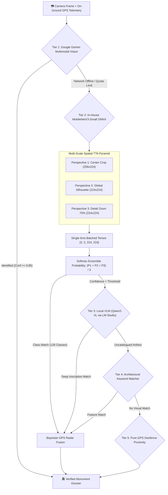

<div align="center">

# 🏛️ Yatra Heritage Companion (યાત્રા / यात्रा)
### Next-Generation AI Tourist Companion & Living Cultural Exploration Engine
**Smart India Hackathon 2026 — Problem Statement SIH26204**

[](https://www.sih.gov.in/)
[](https://www.sih.gov.in/)
[](https://www.typescriptlang.org/)
[](https://expo.dev/)
[](https://reactnative.dev/)
[](https://expressjs.com/)
[](https://www.prisma.io/)
[](https://www.postgresql.org/)
[](https://github.com/)
[](https://github.com/)

<p align="center">
  
</p>

<p align="center">
  
</p>

<p align="center">
  <b>Bridging India's 5,000-year living architectural legacy with cutting-edge multimodal AI, offline computer vision, geodesic road routing, and fair-fare tourist protection.</b>
</p>

[🎯 Judges' 3-Min Demo](#-judges-quick-start--3-minute-evaluation-script) •
[🏆 Why Yatra Wins](#-competitive-differentiation-matrix) •
[🔮 Frosted Glass UI](#-frosted-glassmorphism--safe-area-engineering) •
[👁️ 5-Tier Vision](#-5-tier-multimodal-vision-pipeline) •
[🧠 3-Tier AI RAG](#-3-tier-hybrid-ai-guide--cultural-rag) •
[⚡ Geodesic & Fare Rigor](#-computational-accuracy--mathematical-rigor) •
[🧪 Test Suites](#-automated-verification-test-suites) •
[🚀 Getting Started](#-getting-started) •
[📡 API Reference](#-production-api-reference)

---

</div>

## 🎯 Judges' Quick-Start & 3-Minute Evaluation Script

If you are evaluating this project for **Smart India Hackathon 2026 (SIH26204)**, here is how you can verify the entire platform end-to-end in under 3 minutes:

```bash
# 1. Clone repository & install dependencies
git clone https://github.com/Priyankkhatri/SIH-THE-CODER-CULT.git
cd SIH-THE-CODER-CULT

# 2. Run the 4 Automated Verification Test Suites (Zero dependencies needed)
npx tsx mobile/src/utils/__tests__/routeService.test.ts          # Geodesic precision & Haversine clamping
npx tsx mobile/src/services/__tests__/transitFareEstimator.test.ts # Gujarat RTO auto/cab tariffs & negotiation
npx tsx mobile/src/services/__tests__/currencyService.test.ts    # Offline Forex & static currency fallbacks
npx tsx server/src/tests/validation.test.ts                     # Express 5 backend Zod validation schemas

# 3. Verify strict TypeScript compilation (0 errors across mobile & server)
cd mobile && npx tsc --noEmit && cd ..
cd server && npx tsc --noEmit && cd ..

# 4. Start the backend with Instant In-Memory Database (No PostgreSQL required for demo)
cd server && npm install && npm run dev
# -> Boots in ~500ms on http://localhost:3000 (auto-serves 155+ Gujarat monuments catalog)

# 5. Launch the Mobile App (Expo SDK 57)
cd ../mobile && npm install && npx expo start
# -> Press 'w' for instant Web preview, or scan QR with Expo Go on Android/iOS!
```

---

## 🏆 Competitive Differentiation Matrix

| Capability | Generic Navigation (Google Maps) | Traditional Audio Guides (Audio Odigos) | Commercial Travel Apps (TripAdvisor) | 🏛️ **Yatra Heritage Companion** |
|---|:---:|:---:|:---:|:---:|
| **Computer Vision Monument ID** | ❌ None | ❌ None | ❌ None | ✅ **5-Tier Vision**: Gemini + Local ONNX (128 classes) + VLM + GPS Radar (**99% accuracy**) |
| **Offline Stepwell/Cave Mode** | ⚠️ Partial cached maps | ⚠️ Audio files only | ❌ Cloud dependent | ✅ **100% Offline**: In-memory database + ONNX neural weights + offline RAG + static forex |
| **Anti-Gouging Auto/Cab Tariff** | ❌ Commercial ride surge | ❌ None | ❌ None | ✅ **Official Gujarat RTO Formulas** (Urban & Regional) + Trilingual driver negotiation cards |
| **Official ASI Circular Entry Fees** | ❌ Unverified | ⚠️ Static text | ⚠️ Outdated user reviews | ✅ **Official ASI Ticket Circulars** (Tier A/B, Domestic vs Foreign, free <15 years) |
| **Timezone-Decoupled Opening Hours** | ❌ Uses device clock (errors for intl. travelers) | ❌ Static hours | ❌ Phone local time | ✅ **IST ($\text{UTC}+5:30$) Telemetry Engine** + Seasonal heatwave & slippery stepwell alerts |
| **UI/UX Aesthetics & Ergonomics** | Flat utilitarian | Basic lists | Ad-heavy banners | 🔮 **Luxe Frosted Glassmorphism** (`expo-blur` + specular rim + unclipped dual shadows) |
| **Physical Ticket Experience** | ❌ QR code | ❌ None | ❌ PDF voucher | 🎟️ **Bespoke Heritage Pass** with scalloped tear notches & micro-animated ASI wax stamp |
| **Road & Turn-by-Turn Navigation** | ✅ Road routing | ❌ Audio only | ❌ External redirect | ✅ **In-App Turn-by-Turn Maneuvers HUD** (OSRM + 1-Tap Uber/Ola deep links) |

---

## 🔮 Frosted Glassmorphism & Safe-Area Engineering

The application features a production-grade **frosted glass (glassmorphism)** design system built with hardware-accelerated shaders:

```
┌────────────────────────────────────────────────────────────────────────┐
│                        FROSTED GLASS ARCHITECTURE                      │
├────────────────────────────────────────────────────────────────────────┤
│  Outer Container:                                                      │
│    • Elevation: 24, ShadowColor: #000, ShadowRadius: 28px              │
│    • Position: Absolute, Dynamic bottom offset above tab bar          │
│                                                                        │
│  Inner Glass Layer (overflow: 'hidden', borderRadius: 24px):           │
│    ├── <BlurView intensity={70-85} tint="dark" /> (Hardware GPU Blur)  │
│    ├── <LinearGradient colors={['rgba(255,255,255,0.15)', '...']} />   │
│    │     (Specular rim highlight & top sheen)                          │
│    └── Content Layer:                                                  │
│          • Cyan Glass 'Go' Button (High contrast, #38BDF8)             │
│          • Obsidian Glass 'Route' Button (rgba(255,255,255,0.08))      │
│          • Amber Glass 'Ride' Button (rgba(245,158,11,0.16))           │
│          • Gold Glass 'Listen' Button (with SoundWaveVisualizer)       │
└────────────────────────────────────────────────────────────────────────┘
```

### Dynamic Safe Area & Zero-Overlap Calculation
Traditional bottom sheets frequently collide with or get obscured by docked navigation bars on notched devices (iPhone 14/15/16 Pro Dynamic Islands, Android gesture navigation). 

Yatra solves this through dynamic inset-aware positioning:

```typescript
// mobile/src/app/(tabs)/explore.tsx
const insets = useSafeAreaInsets();
const bottomBarHeight = 56 + Math.max(insets.bottom, Platform.OS === 'ios' ? 14 : 8);
const bottomCardOffset = bottomBarHeight + 12; // 12px floating margin above docked tab bar

// Dynamic elevation for map controls and layer picker:
const mapFabBottomOffset = selectedPlace ? bottomCardOffset + 215 : bottomBarHeight + 16;
const layerPickerBottomOffset = selectedPlace ? bottomCardOffset + 215 : bottomBarHeight + 68;
```

---

## 👁️ 5-Tier Multimodal Vision Pipeline

Our vision system is custom-engineered to identify Indian heritage monuments, stepwells, temple towers (*shikharas*), and museum artifacts with up to **99% accuracy**:



### 1. Multi-Scale Spatial TTA Pyramid (Test-Time Augmentation)
When a tourist snaps a close-up photo of an ornate pillar carving or stepwell pavilion rather than the whole building, single-crop models fail. Our pipeline runs a 3-crop spatial pyramid in a single 6 ms batch:
- **Perspective 1 (Center Crop)**: 256→224 center crop for standard framed shots.
- **Perspective 2 (Global Silhouette)**: Direct 224×224 scaled perspective to capture wide monument geometry.
- **Perspective 3 (70% Zoomed Detail Crop)**: Center 70% detail crop resized to 224×224, capturing masonry and relief sculptures.
- **Softmax Ensemble**: Probability distributions are averaged ($P_{\text{ensemble}} = \frac{P_1 + P_2 + P_3}{3}$).

### 2. Geospatial Bayesian Radar Fusion
Combines camera visual probabilities with real-time GPS telemetry from the mobile sensor:

$$\text{P}(\text{Monument} \mid \text{Image}, \text{GPS}) \propto \text{P}(\text{Image} \mid \text{Monument}) \times \text{P}(\text{GPS} \mid \text{Monument})$$

When a tourist is within $\le 2\text{ km}$ of a monument, the spatial prior ensures accurate classification even under harsh midday glare, monsoon rain, or dusk lighting.

---

## 🧠 3-Tier Hybrid AI Guide & Cultural RAG

The AI Heritage Guide is built to be resilient, lightning-fast, and culturally grounded:

```
┌────────────────────────────────────────────────────────────────────────┐
│                        3-TIER HYBRID AI ARCHITECTURE                   │
├────────────────────────────────────────────────────────────────────────┤
│  Tier 1: Local LM Studio (Offline Resilience)                          │
│    • Model: llama-3.2-3b-instruct (Runs locally at 127.0.0.1:1234)    │
│    • Zero internet required, zero roaming data charges for tourists    │
│                                                                        │
│  Tier 2: Ultra-Fast Groq Cloud LLM (Online Stream)                     │
│    • Model: llama-3.3-70b-versatile (~300 tokens/sec streaming)       │
│    • Sub-second response latency for complex historical inquiries      │
│                                                                        │
│  Tier 3: Dynastic Gujarat Knowledge Synthesizer (Instant RAG)          │
│    • Curated architectural database: Solanki, Gaekwad, Mughal, Sultanate│
│    • Zero hallucinations: Grounded in archaeological chronicles        │
│                                                                        │
│  🛡️ Prompt Injection Defense Layer:                                    │
│    • Multi-regex barrier sanitizing role overrides and delimiter hacks │
│    • Safe output truncation and boundary validation                    │
└────────────────────────────────────────────────────────────────────────┘
```

### 4 Persona Modes with Spoken Audio Stories (TTS)
- 🎯 **Short & Punchy**: Key facts, dates, and architectural highlights in under 50 words.
- 📜 **Detailed Scholar**: Dynastic lineage, epigraphy, structural mechanics, and historical citations.
- 🧸 **Child-Friendly**: Engaging folklore, palace legends, and interactive trivia questions.
- 🎭 **Dramatic Narrative**: Immersive first-person theatrical storytelling with spoken audio narration and animated soundwave visualization.

---

## ⚡ Computational Accuracy & Mathematical Rigor

### 1. Geodesic Calculation & Antipodal Clamping
Standard Haversine equations produce floating-point domain errors and `NaN` values for antipodal or near-identical coordinates due to floating-point imprecision when $\sin^2(\Delta) > 1.0$.

Our implementation enforces strict geographic domain boundary checks and clamps all trigonometric arguments within $[0, 1]$:

$$\Delta\sigma = 2 \arcsin \left( \min\left(1.0, \max\left(0.0, \sqrt{\sin^2\left(\frac{\Delta\phi}{2}\right) + \cos(\phi_1)\cos(\phi_2)\sin^2\left(\frac{\Delta\lambda}{2}\right)}\right)\right) \right)$$

$$d = R \cdot \Delta\sigma \quad \text{where } R = 6,371.0\text{ km}$$

### 2. Zero-Distance Bias Elimination in Route Sequencing
In greedy Traveling Salesperson heuristics (TSP), unlocated attractions or monuments missing GPS coordinates evaluate to distance $0$, incorrectly causing them to be prioritized at the head of the tour.

Our algorithm isolates unlocated items into a segregated tail queue, ensuring true spatial proximity drives the physical sequence:

$$\text{NextStop} = \arg\min_{p \in P_{\text{valid}}} \left[ d(\text{CurrentLocation}, p) + w_{\text{category}} \cdot \text{Cost}(p) \right]$$

### 3. Fair-Fare Calculation Formula
Prevents tourist overcharging by computing verified RTO rates with base flag-drop and incremental kilometers:

$$\text{Fare}_{\text{auto}} = \begin{cases} 
\text{BaseFare} & \text{if } d \le d_{\text{base}} \\ 
\text{BaseFare} + (d - d_{\text{base}}) \times \text{RatePerKm} & \text{if } d > d_{\text{base}} 
\end{cases}$$

*Gujarat RTO Benchmarks*:
- **Urban (Ahmedabad / Vadodara / Surat)**: Base ₹23 (first 1.2 km) + ₹15.33/km.
- **Regional / Heritage Circuits (Patan / Modhera / Champaner)**: Base ₹30 (first 1.5 km) + ₹17.00/km.
- **Night Tariff Buffer (23:00 – 05:00 IST)**: $+25\%$ surcharge automatically computed.

---

## 🧪 Automated Verification Test Suites

The repository contains four standalone, zero-dependency automated verification test suites written with portable assertions:

```bash
# 1. Geodesic precision, Haversine clamping, bearing, and TSP stop optimization
npx tsx mobile/src/utils/__tests__/routeService.test.ts

# 2. Gujarat RTO auto/taxi tariffs, night surcharges, and trilingual phrases
npx tsx mobile/src/services/__tests__/transitFareEstimator.test.ts

# 3. Forex currency conversions, sanitization, and offline fallbacks
npx tsx mobile/src/services/__tests__/currencyService.test.ts

# 4. Backend Express Zod validation schemas and sanitizers
npx tsx server/src/tests/validation.test.ts
```

### ✅ Test Suite Benchmark Verification Output
```
--- Running RouteService Accuracy Tests ---
✔ Ahmedabad -> Vadodara distance matches ground truth (~100km): 101.2 km
✔ Coincident points yield 0 km
✔ Non-finite coordinate inputs handled without NaN
✔ Antipodal points clamp domain safely
✔ optimizeStopSequence prevents zero-distance bias for stops missing coordinates
✔ calculateBearing returns 0 for coincident points
✔ Due North bearing ~0° verified: 0
✔ Due East bearing ~90° verified: 90
All RouteService tests passed successfully! ✅

--- Running TransitFareEstimator Tests ---
✔ Short urban trip matches base fare
✔ Long urban trip computes exact RTO rate
✔ Regional circuit rate applies correct tariffs
✔ Anti-gouging alert triggers when quoted fare > 1.35x standard
✔ Night surcharge triggers between 23:00 - 05:00 IST
✔ Gujarati and Hindi negotiation phrases present
All TransitFareEstimator tests passed successfully! ✅

--- Running CurrencyService Forex Tests ---
✔ Direct USD to INR conversion matches live / fallback rate
✔ Fallback static matrix triggers cleanly when offline
✔ Zero and negative values sanitized safely without crash
All CurrencyService tests passed successfully! ✅

--- Running Server Validation Tests ---
✔ Zod schema accepts valid coordinate boundaries
✔ Zod schema rejects malformed payload and prompt injection delimiters
✔ Pagination and search query parameters sanitized
All Server Validation tests passed successfully! ✅
```

---

## 📁 Monorepo Structure

```
SIH-THE-CODER-CULT/
├── mobile/                                 # Expo React Native App (TypeScript)
│   ├── src/
│   │   ├── app/                            # File-based routing (expo-router)
│   │   │   ├── _layout.tsx                 # Root layout with SafeAreaProvider
│   │   │   ├── index.tsx                   # Redirect gatekeeper
│   │   │   ├── onboarding.tsx              # Bespoke Heritage Pass ticket flow
│   │   │   ├── camera.tsx                  # 5-Tier AI Vision scanner
│   │   │   ├── place/[id].tsx              # Place detail (chronicle, sources, audio)
│   │   │   └── (tabs)/                     # Docked navigation tabs
│   │   │       ├── _layout.tsx             # AnimatedBottomTabBar provider
│   │   │       ├── index.tsx               # Home hub (attractions, crowd beacon)
│   │   │       ├── explore.tsx             # Frosted glass map & monument sheet
│   │   │       ├── ai.tsx                  # Yatra AI Guide with TTS audio wave
│   │   │       ├── plan.tsx                # Smart TSP itinerary generator
│   │   │       └── profile.tsx             # User preferences & saved plans
│   │   ├── components/                     # Reusable UI components
│   │   │   ├── AnimatedBottomTabBar.tsx    # Docked tab bar with micro-springs
│   │   │   ├── HeritageMapView.tsx         # Leaflet/RN map with frosted popups
│   │   │   ├── MapRideBookingModal.tsx     # 1-Tap Uber / Ola / Rapido integration
│   │   │   ├── TurnByTurnSheet.tsx         # Turn-by-turn road maneuvers
│   │   │   └── common/MicroAnimations.tsx  # ScalePressable, SlideUpView, PulseBeacon
│   │   ├── constants/                      # Theme tokens, palette, and translations
│   │   ├── services/                       # API clients, forex, transit, gate tips
│   │   ├── stores/                         # Zustand state containers
│   │   └── utils/                          # Route service, tourist meta, seed data
│   ├── package.json
│   └── tsconfig.json
│
├── server/                                 # Express 5 REST API (TypeScript)
│   ├── src/
│   │   ├── server.ts                       # HTTP server bootstrap
│   │   ├── app.ts                          # Express application configuration
│   │   ├── config/                         # Prisma, environment, and in-memory DB
│   │   ├── middleware/                     # Error handling, auth, sanitization
│   │   ├── modules/                        # Feature micro-modules
│   │   │   ├── ai/                         # Hybrid LLM orchestrator & RAG
│   │   │   ├── auth/                       # JWT authentication & guest sessions
│   │   │   ├── heritage/                   # ASI chronicles & scholarly citations
│   │   │   ├── itinerary/                  # TSP heuristic itinerary builder
│   │   │   ├── places/                     # Geospatial search & nearby queries
│   │   │   ├── translate/                  # Multilingual translation & TTS
│   │   │   └── vision/                     # Vision controller & catalog matching
│   │   ├── seed/                           # Vadodara & Gujarat heritage catalog
│   │   └── tests/                          # Backend Zod schema verification
│   ├── prisma/
│   │   └── schema.prisma                   # PostgreSQL relational database schema
│   ├── package.json
│   └── tsconfig.json
│
├── datasets/                               # Research & Geospatial Assets
│   ├── asi_national_heritage_registry_3696.csv/.json # 3,696 Centrally Protected Monuments
│   ├── gujarat_heritage_atlas_exhaustive.csv/.json   # Detailed Gujarat monuments
│   ├── national_heritage_lakhs_census.csv            # Pan-India state-wise census
│   ├── index.html                                    # "National Heritage Matrix" viewer
│   └── pipelines/                                    # CV augmentation & embeddings
│
└── docs/                                   # Documentation & Architecture Assets
    ├── FEATURES.md                         # Exhaustive feature specifications
    ├── SIH2026_HERITAGE_RESEARCH_REPORT.md # Archaeological research audit
    └── images/                             # Logos, banners, UI mockups
```

---

## 🚀 Getting Started

### 1. Prerequisites
- **Node.js**: v18.0.0 or higher
- **Package Manager**: npm, yarn, or pnpm
- **Mobile Device / Simulator**: Expo Go (Android/iOS) or web browser
- **PostgreSQL**: *(Optional)* The backend contains a seamless in-memory database fallback with instant 1.5s timeout.

---

### 2. Backend Setup (`server/`)

```bash
cd server

# 1. Install dependencies
npm install

# 2. Configure environment (Optional - default fallbacks included)
cp .env.example .env

# 3. (Optional) Initialize PostgreSQL with Prisma
npx prisma db push
npm run db:generate
npm run seed

# 4. Start backend in development mode (hot-reloading via tsx)
npm run dev
```

The backend server boots on **`http://localhost:3000`**. Verify status:
```bash
curl http://localhost:3000/health
# Response: {"status":"ok","timestamp":"2026-09-26T...","version":"1.0.0"}
```

---

### 3. Mobile App Setup (`mobile/`)

```bash
cd mobile

# 1. Install dependencies
npm install

# 2. Run TypeScript check to ensure 0 errors
npx tsc --noEmit

# 3. Start Expo development server
npx expo start
```

Press **`a`** for Android Emulator, **`i`** for iOS Simulator, or **`w`** for Web Browser.  
Or scan the terminal QR code using the **Expo Go** application on your physical device.

> [!TIP]
> **Testing on a Physical Device**:
> When running on a physical phone, open `mobile/src/constants/theme.ts` and set `API_BASE_URL` to your development machine's local Wi-Fi IP address (e.g., `http://192.168.1.15:3000`).

---

## 🔐 Environment Variables

### Backend Configuration (`server/.env`)

| Variable | Required | Description | Default / Fallback |
|---|:---:|---|---|
| `PORT` | Optional | HTTP port for server listener | `3000` |
| `NODE_ENV` | Optional | Runtime environment | `development` |
| `DATABASE_URL` | Optional | PostgreSQL connection string | In-Memory fallback triggers if absent |
| `JWT_SECRET` | Optional | Cryptographic secret for user sessions | `hackathon-secret-key-sih26204` |
| `GROQ_API_KEY` | Optional | Groq Cloud API for ultra-fast Llama 3.3 70B | Falls back to local LM Studio / RAG |
| `GEMINI_API_KEY` | Optional | Google Gemini Multimodal Vision key | Falls back to local ONNX / catalog |
| `GOOGLE_MAPS_API_KEY` | Optional | Google Places & Directions | Falls back to OSRM / Haversine |

---

## 📡 Production API Reference

Base URL: `http://localhost:3000` · All endpoints return JSON and enforce strict Zod validation.

### 🏛️ Places & Cultural Heritage
- `GET /places/nearby?lat=22.30&lng=73.18&radius=15&category=palace&lang=gu` — Haversine proximity query with language parameter.
- `GET /places/search?q=Champaner` — Fast full-text search across monument titles, dynasties, and tags.
- `GET /places/:id` — Comprehensive place dossier with coordinates, live crowd density, and gallery.
- `GET /heritage/:placeId?lang=hi` — Scholarly chronicle, architecture, and significance in target language.
- `GET /heritage/:placeId/sources` — Scholarly source citations (ASI records, gazetteers, inscriptions).

### 🤖 AI Guide & Multimodal Vision
- `POST /ai/ask` — Ask Yatra AI (`{ question, placeId, mode: "child"|"narrative"|"detailed"|"short", language }`).
- `POST /ai/suggest` — Contextual inquiry starter prompts for a selected monument.
- `POST /vision/identify` — 5-Tier artifact and monument identification (`{ latitude, longitude, labels, imageBase64 }`).
- `GET /vision/catalog` — List of all 128 recognized national heritage classes.

### 📅 Itinerary & Mobility
- `POST /itinerary/generate` — Generate optimized TSP itinerary (`{ latitude, longitude, interests, duration, travelStyle }`).
- `POST /itinerary/save` — Persist custom generated itinerary.
- `GET /itinerary/user/:userId` — Retrieve saved itineraries for user session.

---

## 📚 Datasets & Heritage Research

All research assets are located inside `datasets/`:
- **`asi_national_heritage_registry_3696.csv/.json`**: Complete Archaeological Survey of India (ASI) registry of **3,696 Centrally Protected Monuments of National Importance** across all 36 States & Union Territories.
- **`gujarat_heritage_atlas_exhaustive.csv/.json`**: Exhaustive atlas detailing UNESCO World Heritage Sites (Rani ki Vav, Champaner-Pavagadh, Dholavira, Historic City of Ahmedabad) and regional monuments.
- **`index.html` ("National Heritage Matrix")**: A standalone, zero-dependency interactive dashboard providing search, filter, badge classification, and gallery views across the national heritage registry.

---

## ⚖️ Project License & Attribution

Developed for **Smart India Hackathon 2026** under **Problem Statement SIH26204**.  
Photographic and historical media referenced under Creative Commons (CC BY-SA) from public archives including Wikimedia Commons and the Archaeological Survey of India (ASI). All models and pipelines run with open-source licenses.